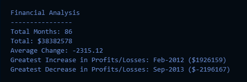

# Console Finances

This JavaScript code is designed to perform comprehensive financial analysis on a given dataset. It calculates and provides key metrics to gain insights into the financial performance over a period of time. The app extracts information such as the total number of months included in the dataset, the net total amount of Profit/Losses over the entire period, the average of the changes in Profit/Losses (representing the overall trend), and identifies critical points by determining the greatest increase and decrease in Profit/Losses. For the latter, the app not only reports the amounts but also specifies the corresponding dates, offering a detailed understanding of the dataset's financial dynamics. 

## Project Results

## Deployment

* The site was deployed to GitHub Pages. The steps required are as follows:
    * From the GitHub main repository, navigate to Settings page.
    * Locate the Pages section.
    * Here, select Main Branch from the drop-down menu.
    * Once selected, GitHub will generate a link to the complete website.

## Technologies Used

### Languages Used

* [HTML5](https://en.wikipedia.org/wiki/HTML5)
* [JavaScript](https://en.wikipedia.org/wiki/JavaScript)
* [Markdown](https://en.wikipedia.org/wiki/Markdown)

## License

N/A
